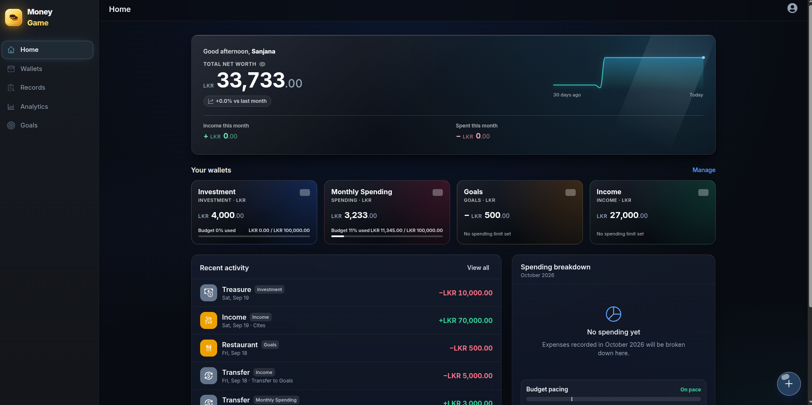
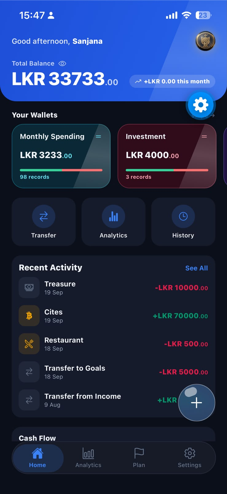
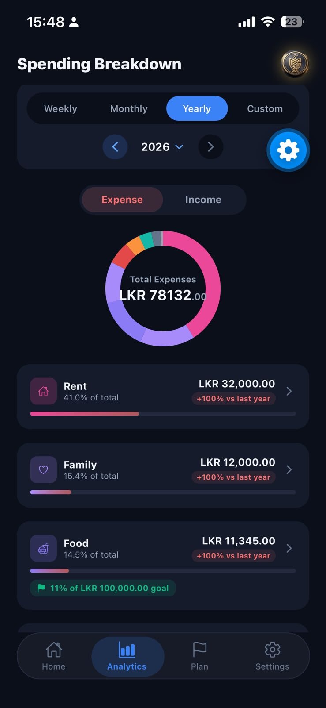
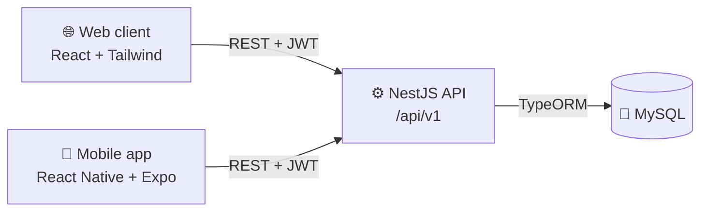
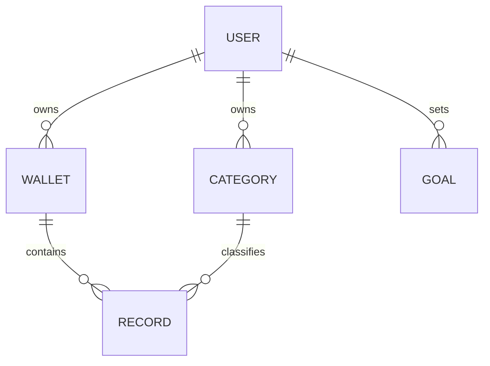

<div align="center">

# 💰 MoneyTracker

**A full-stack personal finance tracker that runs on the web and on your phone.**

Track income and expenses across multiple wallets, organize them with custom categories, set savings goals, and see where your money goes with interactive charts.


</div>

---

## Table of contents

- [Features](#-features)
- [Screenshots](#-screenshots)
- [Tech stack](#-tech-stack)
- [Project structure](#-project-structure)
- [Getting started](#-getting-started)
- [Architecture](#-architecture)
- [Scripts reference](#-scripts-reference)
- [Contributing](#-contributing)

## ✨ Features

- 👛 **Multiple wallets** — keep separate balances (cash, bank, savings…) each with its own currency.
- 🧾 **Income & expense records** — log transactions against a wallet and a category.
- 🗂️ **Custom categories** — a sensible default set is created on sign-up; add your own icons and reorder them with drag-and-drop.
- 📊 **Charts & insights** — income vs. expense totals and trends grouped by day, week, month, quarter, or year, plus per-category breakdowns.
- 🎯 **Goals** — set savings targets and follow your progress.
- 📥 **Bulk import** — upload a CSV/Excel spreadsheet, review it in an editable grid, and import records in one go.
- 🔐 **Secure auth** — bcrypt-hashed passwords and JWT-protected API; tokens kept in secure storage on mobile.
- 🌗 **Light / dark mode** on mobile, following the system theme or a manual override.
- 📱 **Responsive web app** with a bottom tab bar on small screens, plus a **native mobile app** built with Expo.

## 📸 Screenshots

**Web dashboard**



| Mobile home | Mobile analytics |
| :---: | :---: |
|  |  |

## 🛠 Tech stack

| Layer | Technologies |
| --- | --- |
| **API** (`Server/`) | NestJS 11, TypeORM 0.3, MySQL, Passport (local + JWT), bcrypt, Swagger |
| **Web** (`Client/`) | React 18, TypeScript, Tailwind CSS, Redux Toolkit, TanStack Query, React Router v6, Chart.js, dnd-kit, Luxon, Lodash |
| **Mobile** (`Mobile/`) | React Native, Expo SDK 57, Expo Router, Redux Toolkit, TanStack Query, Expo Secure Store |
| **CI / Deploy** | GitHub Actions → Azure Web Apps (API) |

## 📁 Project structure

```text
MoneyTracker/
├── Server/   # NestJS REST API — auth, users, wallets, categories, records, goals
├── Client/   # React + TypeScript web app (with a small design system in src/components/ui)
├── Mobile/   # React Native + Expo mobile app (expo-router)
├── app/      # Legacy Flutter client — deprecated, superseded by Mobile/
└── data/     # Sample CSV data for trying out the import feature
```

Each project is **independent** — there is no root workspace. Install and run each from inside its own folder.

## 🚀 Getting started

### Prerequisites

- **Node.js** 18+ and npm
- **MySQL** 8 (local or remote)
- **Expo Go** app on your phone (for the mobile client) — its version must match the project's Expo SDK (57)

### 1. Clone the repository

```bash
git clone https://github.com/SanjanaKumarasingha/MoneyTracker.git
cd MoneyTracker
```

### 2. Run the API server

```bash
cd Server
npm install
cp .env.example .env      # then fill in the values below
npm run m:run             # apply database migrations
npm run start:dev         # http://localhost:5000
```

`Server/.env`:

```env
DB_HOST=localhost
DB_PORT=3306
DB_USERNAME=root
DB_PASSWORD=your_password
DB_DATABASE=money_tracker
JWT_SECRET=a_long_random_secret
JWT_EXPIRATION_TIME=1d
CORS_ORIGINS=             # optional, comma-separated extra origins (dev only)
```

The API is served under `/api/v1`, and interactive **Swagger docs** are available at **http://localhost:5000/api** in development.

### 3. Run the web client

```bash
cd Client
npm install
echo "REACT_APP_BASE_URL=http://localhost:5000/api" > .env   # the client appends /v1 itself
npm start                 # http://localhost:3000
```

### 4. Run the mobile app

```bash
cd Mobile
npm install
cp .env.example .env      # set EXPO_PUBLIC_API_URL
npx expo start            # scan the QR code with Expo Go
```

> **Note:** a phone or emulator can't reach `localhost` on your computer. Set `EXPO_PUBLIC_API_URL` to your machine's **LAN IP**, e.g. `http://192.168.1.10:5000/api/v1`. The server's development CORS settings already allow private-network origins.

## 🏗 Architecture



**Domain model**



- Every `Record` is an income or expense entry belonging to exactly one wallet and one category.
- All entities use **soft deletes**, and sensitive fields (passwords, internal timestamps) are excluded from API responses.
- Schema changes always go through **TypeORM migrations** (`synchronize` is off).
- The web and mobile clients deliberately mirror each other's `types`, `apis`, and `store` folders so logic ports cleanly between them.

## 📜 Scripts reference

<details>
<summary><b>Server</b></summary>

| Command | Description |
| --- | --- |
| `npm run start:dev` | Start the API in watch mode |
| `npm run build` | Compile to `dist/` |
| `npm run lint` / `npm run format` | ESLint / Prettier |
| `npm run test` / `npm run test:e2e` | Unit / end-to-end tests |
| `npm run m:gen --name=Name` | Generate a migration from entity changes |
| `npm run m:run` | Apply pending migrations |

</details>

<details>
<summary><b>Client</b></summary>

| Command | Description |
| --- | --- |
| `npm start` | Dev server on port 3000 |
| `npm run build` | Production build |
| `npm test` | Jest + React Testing Library |

</details>

<details>
<summary><b>Mobile</b></summary>

| Command | Description |
| --- | --- |
| `npx expo start` | Start the Expo dev server |
| `npx expo export --platform android` | Bundle smoke test (no device needed) |
| `npx tsc --noEmit` | Type-check |
| `npx expo install <pkg>` | Add an SDK-compatible dependency |

</details>

## 🤝 Contributing

Contributions, issues, and feature requests are welcome!

1. Fork the project
2. Create a feature branch: `git checkout -b feat/amazing-feature`
3. Commit your changes: `git commit -m "feat: add amazing feature"`
4. Push the branch: `git push origin feat/amazing-feature`
5. Open a pull request

## 👤 Author

**Sanjana Kumarasingha** — [@SanjanaKumarasingha](https://github.com/SanjanaKumarasingha)

<div align="center">

⭐ If you find this project useful, consider giving it a star!

</div>
